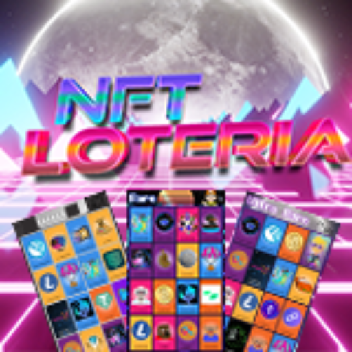

# NFT Loteria

   

NFT Loteria brings the spirit of traditional bingo (loteria) to the Internet Computer. Each tabla is an EXT-standard NFT; when players join games using your tabla, you earn 10% of their winnings. Classic modes like line and blackout make every session feel familiar while keeping rewards on-chain.

## Overview

- 363 unique tablas minted as EXT NFTs on the Internet Computer.
- Tabla owners earn a 10% share whenever their board wins.
- Game modes include quick line wins and full-board blackout rounds.
- Built with SvelteKit and Motoko.

## How the game works

1) You own or choose a tabla (bingo card). Ownership is represented by an EXT NFT.
2) A host draws cards; players mark their tablas.
3) Winning patterns depend on the mode: a single line for quick matches, or blackout for longer, high-stakes rounds.
4) When someone wins using your tabla, you collect 10% of the total pot automatically.

## Limitations and roadmap

- Current EXT canister does not expose the owner principal, so transfers are not compatible with ICRC standards.
- Due to the EXT canister registry, owner principals cannot be updated via intercaniter calls.
- ICRC-7 may be adopted in the future.

## License

This project is released under the MIT License.
